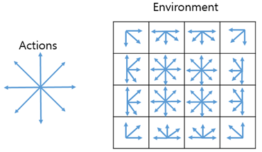
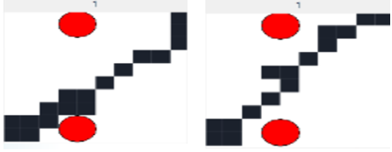
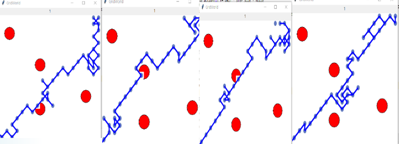
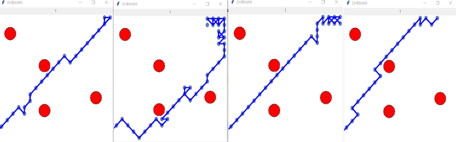
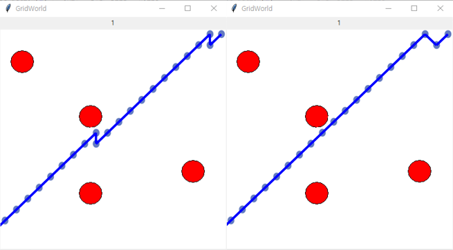

# Imitation Learning; Optimal Multiple Path Search Using VAIL

## How to

**The Customized Grid-World environment and actions**

 

***environment.py*** : Currently, the customized Grid-World of the 20x20 pixel window is configured.

***Expert dataset 1,2*** : Examples of configuring expert dataset with the pickle module

***expert_generator.py*** : You can use this file to create expert data.

***main.py*** : You can run this program by running ***main.py***.

## Result
### two obstacles - 10 x 10 GridWorld
You should need expert data to find approximately 50 shortest paths.

	This is a captured image executed from our old code.

**150 epoch**

 

**500 epoch**

 

### four obstacles - easy path
You should need expert data to find approximately 200 shortest paths.

**300 epoch**

 

**500 epoch**

 

**700 epoch**

 

**900 epoch**

 

**1000 epoch**

 

### four obstacles - difficult path
You should need expert data to find approximately 400-500 shortest paths.

**700 epoch**

 

**900 epoch**

 

**1000 epoch**

 

## Related papers
- [1] J. Ho, et al., ["Generative Adversarial Imitation Learning"](https://papers.nips.cc/paper/6391-generative-adversarial-imitation-learning.pdf), NIPS 2016.

- [2] Xue Bin Peng, et al., ["Variational Discriminator Bottleneck. Improving Imitation Learning, Inverse RL, and GANs by Constraining Information Flow"](https://arxiv.org/pdf/1810.00821.pdf), ICLR 2019.

## Referenced code
RL-korea : [Dongmin Lee, et al.](https://github.com/reinforcement-learning-kr/lets-do-irl)

## Author
Jungseob Lee / [ js-lee-AI](https://github.com/js-lee-AI) / omanma1928@naver.com
